Navigate through my Projects 👇

---

## 💻 Tech Stack

| Area                   | Technologies                                                                                                                                                                                                                                                                                                                                                                                                                                                                                                                                                                                                                                                                                                                                                                                                        |
| ---------------------- | ------------------------------------------------------------------------------------------------------------------------------------------------------------------------------------------------------------------------------------------------------------------------------------------------------------------------------------------------------------------------------------------------------------------------------------------------------------------------------------------------------------------------------------------------------------------------------------------------------------------------------------------------------------------------------------------------------------------------------------------------------------------------------------------------------------------- |
| 🌐 Frontend            |                                                            |
| 🚀 Backend             |                                                                                                                              |
| 🗄️ Database            |                                                                                                                                                                                                                                                                                                                                                                                                                                                                                                                                           |
| 📝 CMS                 |       |
| 🛠️ Tools und DevOps    |                                                  |
| 🎨 Design              |                                                                                                                                                                                                                                                                                                                              |
| 📚 Testing und Quality |                                                                                                                                                                                                                                                                                                                                                                                                     |
| 📖 Markup              |                                                                                                                                                                                                                                                                                                                                                                                                                                                                                                                                                                                                                                                                         |

---

### 

###  

|  |  |  |
| :---------------------------------------------------------------------------------------------------------------------------------------------------------: | :--------------------------------------------------------------------------------------------------------------------------------------------------------: | :--------------------------------------------------------------------------------------------------------------------------------------------------------: |

|  |  |  |
| :-------------------------------------------------------------------------------------------------------------------------------------------: | :------------------------------------------------------------------------------------------------------------------------------------------: | :------------------------------------------------------------------------------------------------------------------------------------------: |

[⬆ Back to Top](#)

---

### 

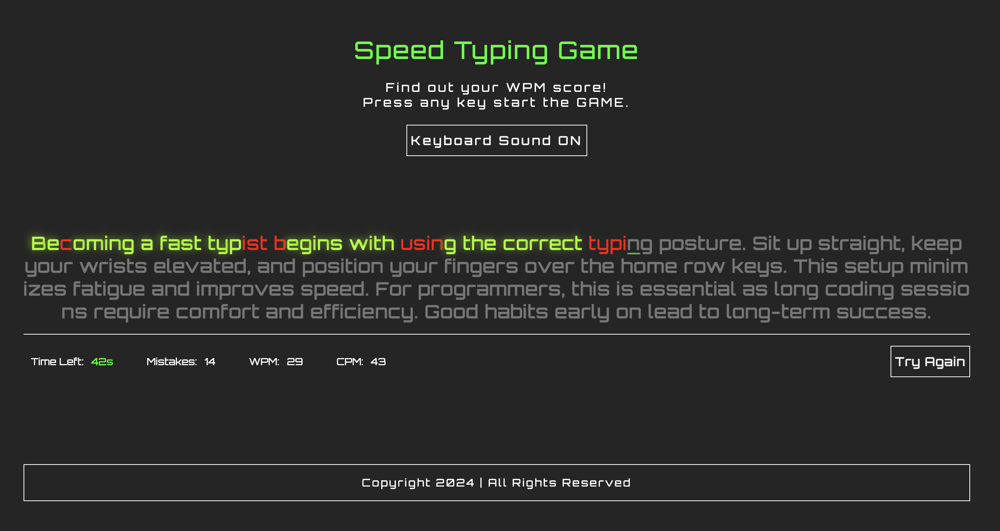

|  |  |
| :-----------------------------------------------------------------------------------------------------------------------------: | :-------------------------------------------------------------------------------------------------------------------------: |

[⬆ Back to Top](#)

---

###   

| 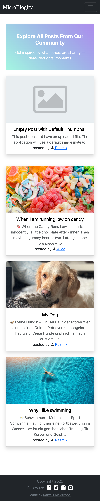 | 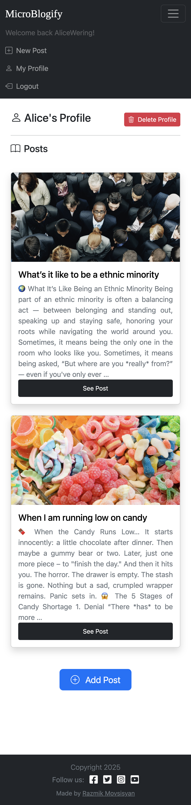 | 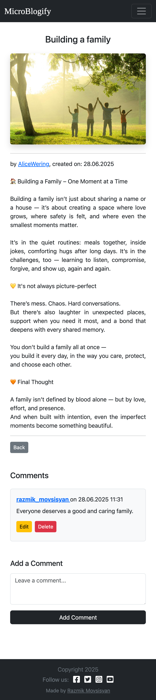 |
| :---------------------------------------------------------------: | :--------------------------------------------------------------: | :--------------------------------------------------------------: |

|  |  |
| :-------------------------------------------------------------------------------------------------------------------------: | :-----------------------------------------------------------------------------------------------------------------------------------------------: |
|                |                                      |

[⬆ Back to Top](#)

---

### 

| 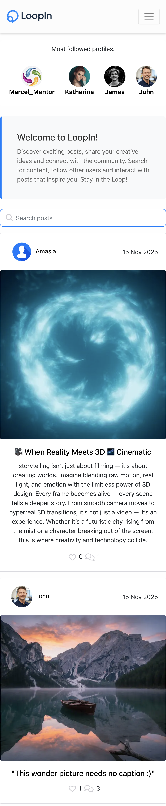 | 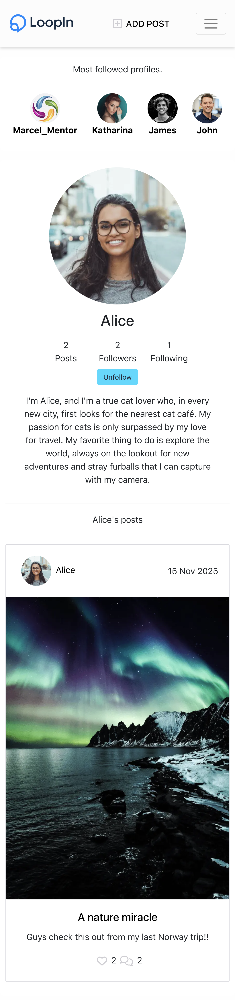 | 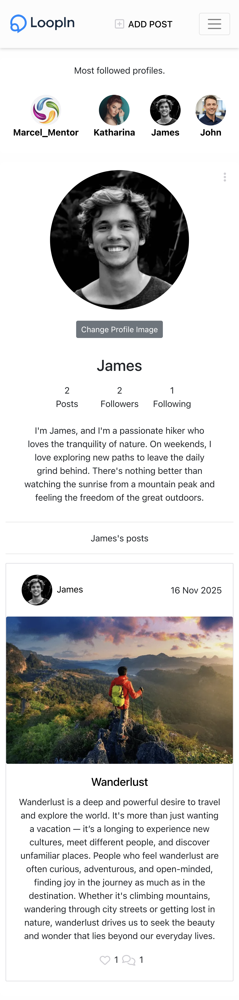 |
| :-----------------------------------: | :-----------------------------------: | :-----------------------------------: |
| 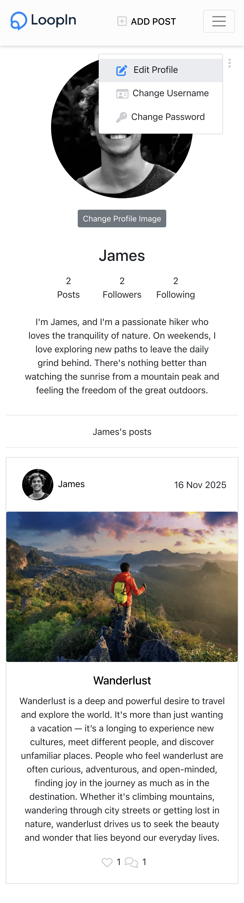 | 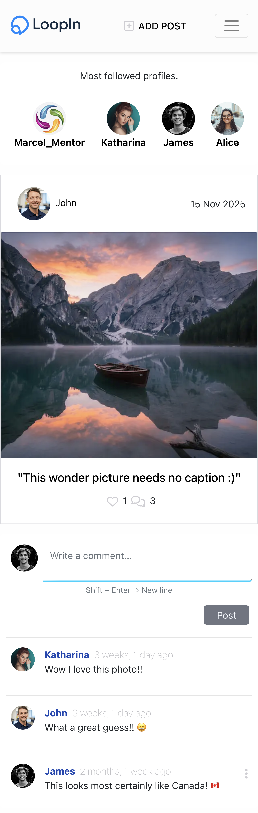 | 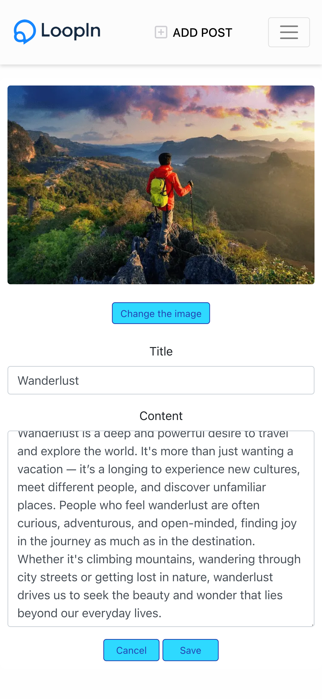 |

[⬆ Back to Top](#)

---

> Here you’ll find projects I built even before formally studying full stack software development, reflecting my early passion and drive.

###  

| 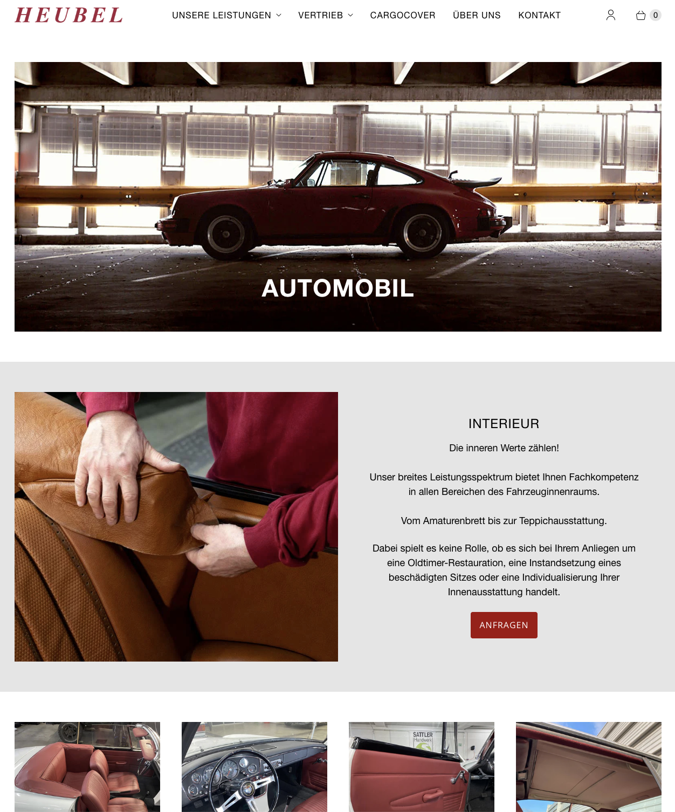 | 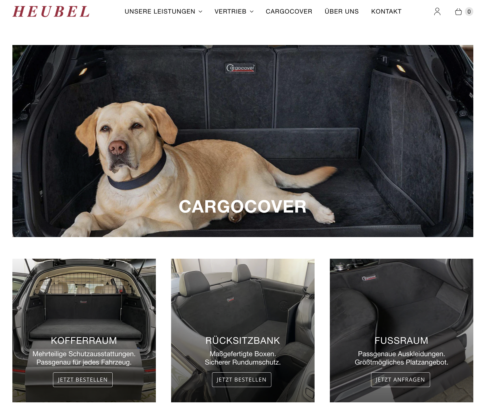 |  |
| :-----------------------------------: | :-----------------------------------: | :-----------------------------------: |

###  

| 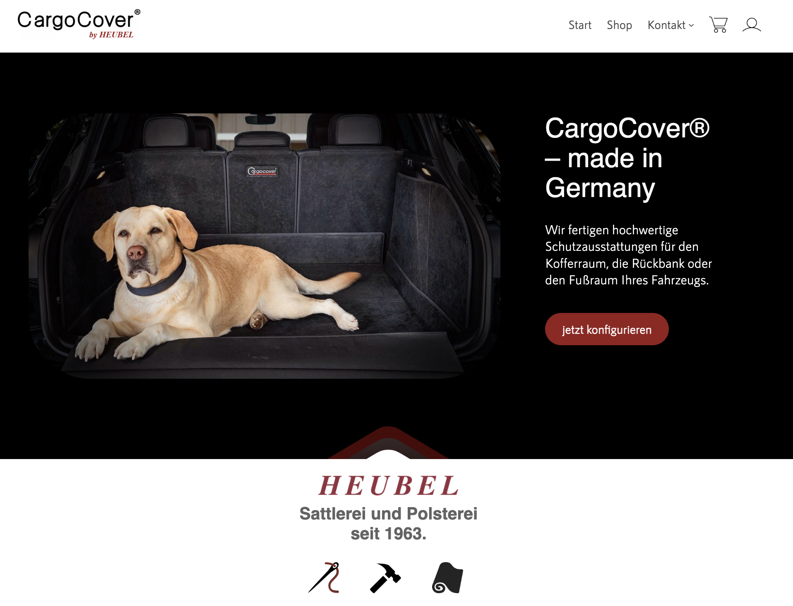 | 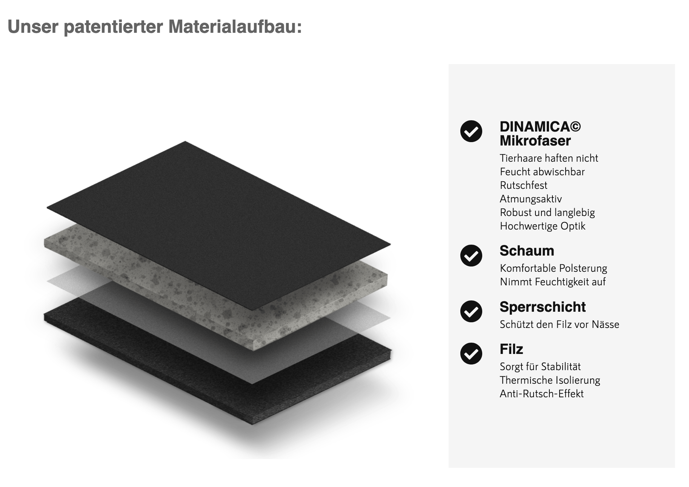 |  |
| :-----------------------------------------------: | :-----------------------------------------------: | :-----------------------------------------------: |
| 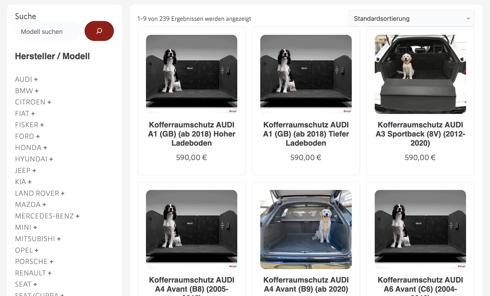 | 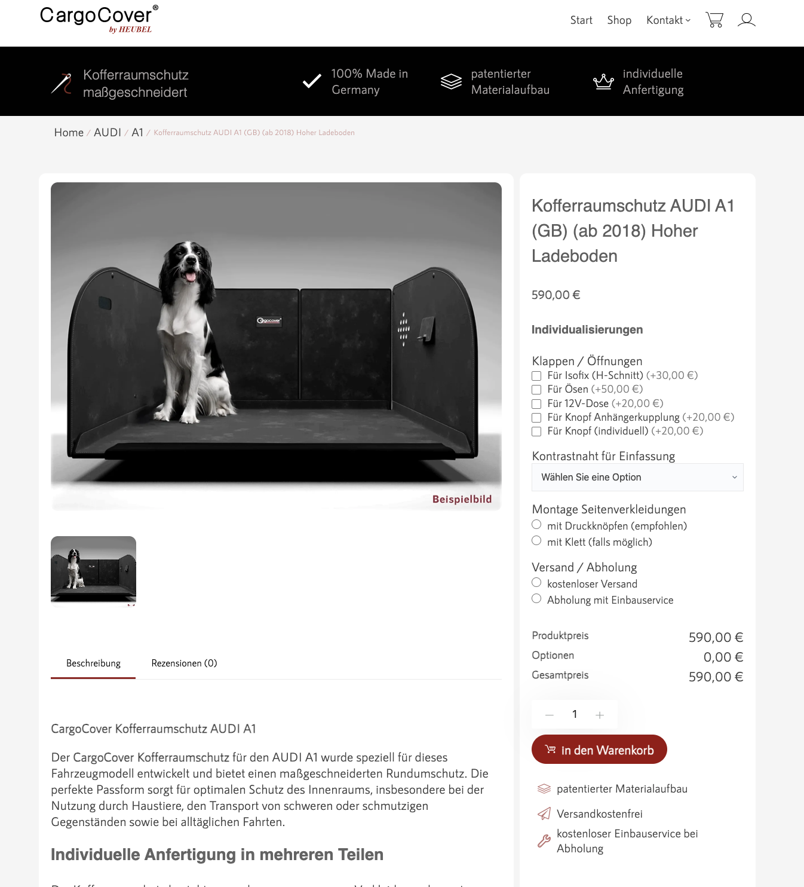 | 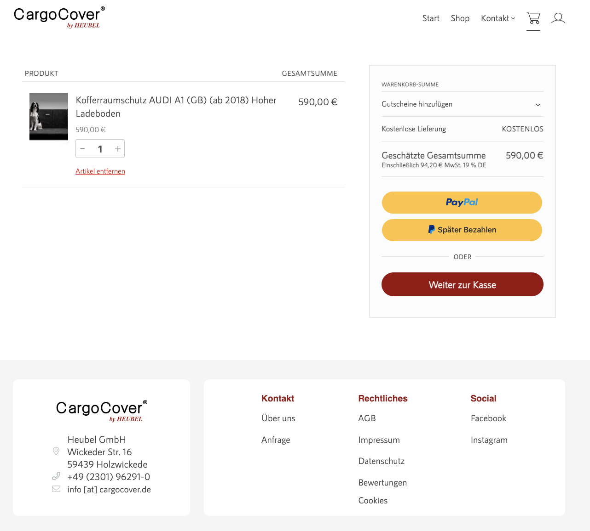 |

[⬆ Back to Top](#)

---
